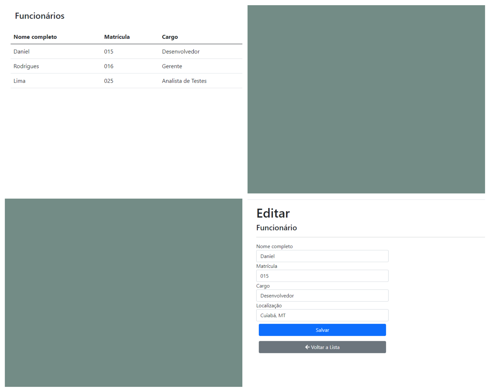
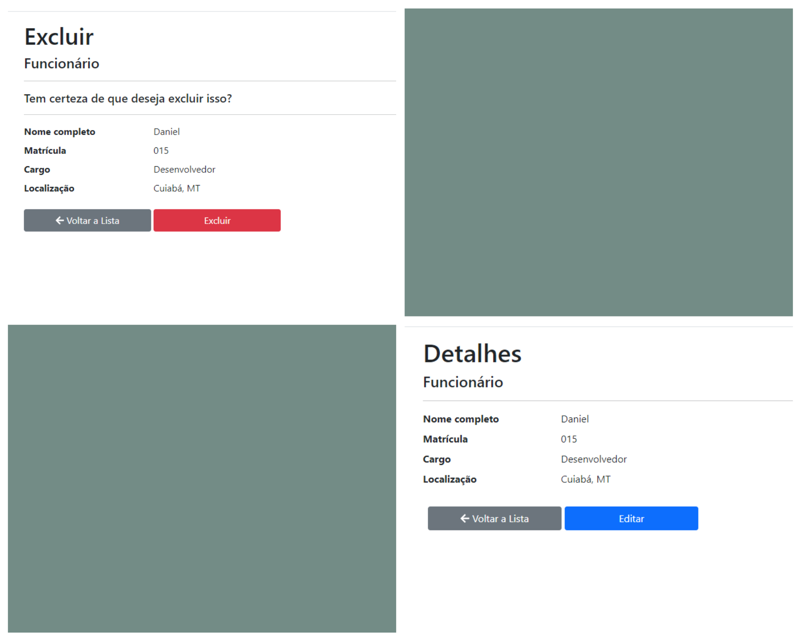

# CadastroFuncionarios



## 🚀 Começando

Um CRUD (Create, Read, Update, Delete) é um conjunto de operações básicas de 
gerenciamento de dados que são frequentemente implementadas em sistemas de software.

### 🔧 Instalação

Passo-a-passo que informam o que você deve executar para ter um ambiente de desenvolvimento em execução.

```
git clone <link repo>
```

## 📦 Implantação

Usando Entity Framework: ORM (Object-Relational Mapping) para se conectar ao banco de dados e executar operações de CRUD.

## 🛠️ Construído com

* [C#](#)
* [.NET](#)
* [ASP.NET](#)

⌨️ por [Daniel Rodrigues de Lima](https://github.com/daniellimar/) 